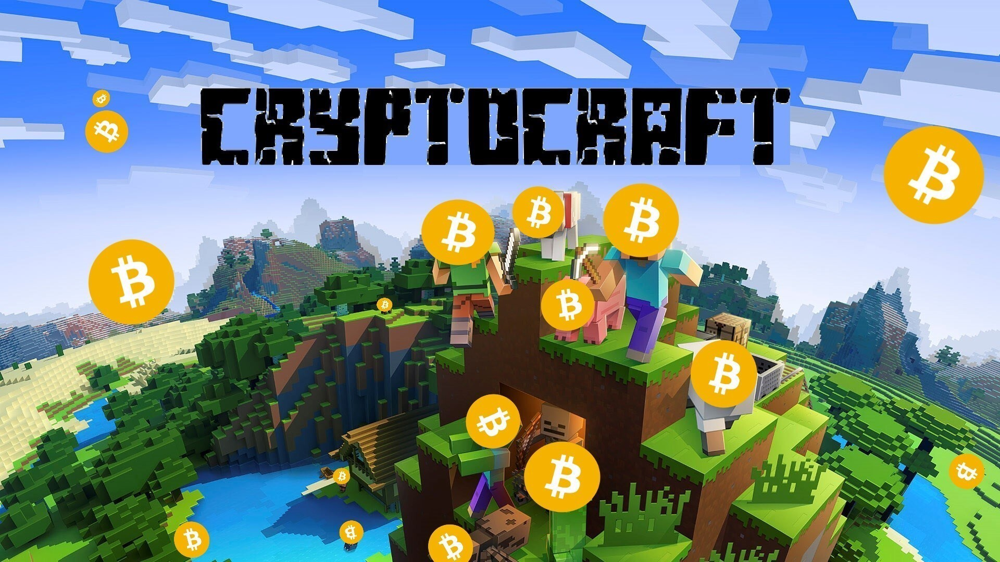
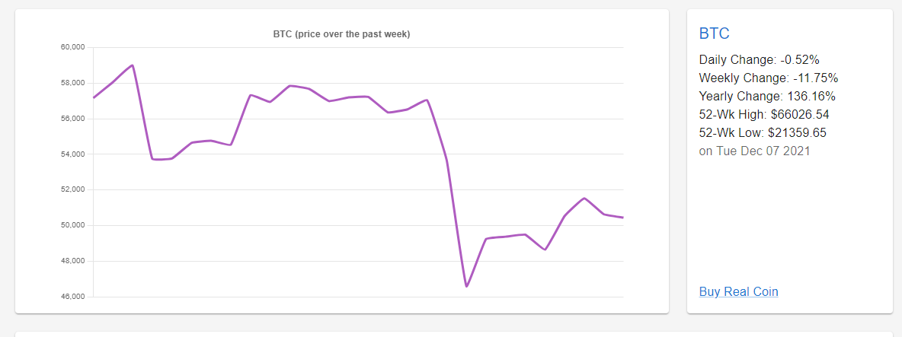
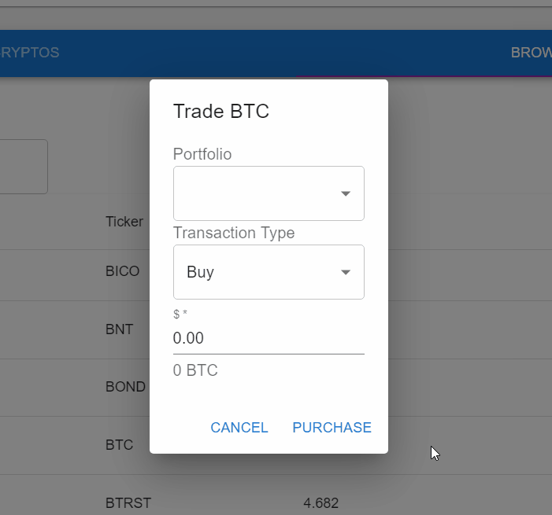

# Cryptocraft
[](https://opensource.org/licenses/MIT)

---

## Table of Contents

- [Cryptocraft](#Cryptocraft)
  - [Table of Contents](#table-of-contents)
  - [Description](#description)
  - [Features](#features)
  - [Prerequisites](#prerequisites)
  - [Built With](#built-with)
  - [Technologies Used](#technologies-used)
  - [Practices Used](#practices-used)
  - [Important Code Snippets](#important-code-snippets)
  - [Deployed Link](#deployed-link)
  - [Authors](#authors)
  - [License](#license)
  - [Questions](#questions)
  

## Description

     
### “Risk Free Cryptoverse Exploration”

Cryptocraft is an cryptocurrency trading simulator designed to allow users to explore and experiment with crypto. In this MERN stack application, users can practice crypto-trading with virtual money, and gain insight on how the crypto-market works without losing real money. You can either trade by yourself, or enter a small competition with other users for the largest returns.

#### Inspiration
In high school there was a national competition for this club called DECA, which was the stock market game. Every team had 100k in virtual money to put into the market, and the team with the highest return value would win.

#### Solution
With crypto being an emerging market, we want users to obtain more knowledge of the trends in the market, only without the financial risk. Just like the video game Minecraft, our project is motivated by the creativity of the user, combined with practicality and logic in order to survive mobs and in this case, the fluctuations in the market.


**[Click this link to go to Cryptocraft!](https://crypto-craft.herokuapp.com/)**
 <br />


## Features

**Displaying Coin Data**
* Queries data using GraphQL from database and fetches information from Crypto Watch API to render data. Graph is rendered with Chart.js, and context is used to pass around the current ticker.
<p align="center">
  <a href="https://crypto-craft.herokuapp.com/">
    
  </a>
</p>
 <br />

**Buy and Sell Coins**
* Users can browse different prices and statistics of cryptos listed on the Crypto Watch API
and choose to trade the currency. A dialog rendered by React State appears and allows the user to give further details on their transaction.
<p align="center">
  <a href="https://crypto-craft.herokuapp.com/">
    
  </a>
</p>
 <br />


## Prerequisites
Any modern internet browser will do!

## Built With

* [Apollo Server](https://www.apollographql.com/docs/apollo-server/getting-started/)
* [Axios](https://axios-http.com/)
* [bcrypt](https://www.npmjs.com/package/bcrypt)
* [Bootstrap](https://getbootstrap.com/)
* [Chart.js](https://www.chartjs.org/)
* [Concurrently](https://www.npmjs.com/package/concurrently)
* [CreateReactApp](https://github.com/facebook/create-react-app)
* [Crypto Watch API](https://docs.cryptowat.ch/rest-api)
* [CSS](https://developer.mozilla.org/en-US/docs/Web/CSS)
* [dotenv](https://www.npmjs.com/package/dotenv)
* [ESLint](https://eslint.org/)
* [Express.js](https://expressjs.com/)
* [GraphQL](https://graphql.org/)
* [HTML](https://developer.mozilla.org/en-US/docs/Web/HTML)
* [JavaScript](https://developer.mozilla.org/en-US/docs/Web/JavaScript)
* [Jest](https://jestjs.io/)
* [JSON Web Token](https://jwt.io/)
* [JWT Decode](https://www.npmjs.com/package/jwt-decode)
* [Material UI](https://mui.com/)
* [Mongo DB](https://www.mongodb.com/)
* [Mongoose](https://mongoosejs.com/)
* [Nodemon](https://www.npmjs.com/package/nodemon)
* [Node.js](https://nodejs.org/en/)
* [React](https://reactjs.org/)


## Technologies Used

* [Microsoft Visual Studio Code](https://code.visualstudio.com/)
* [Git Bash](https://git-scm.com/downloads)
* [GitHub](https://github.com/)
* [Google Chrome Developer Tools](https://developer.chrome.com/docs/devtools/)
* [Heroku](https://heroku.com/)
* [Robo 3T](https://robomongo.org/)

## Practices Used

* Agile style User Story and Acceptance Criteria.
* [Web Content Accessibility Guidelines](https://www.w3.org/WAI/standards-guidelines/wcag/)

## Important Code Snippets

**Example Resolver from GraphQL**
* Implementation of querying data of the current user. First checks the context for authentication purposes using JWT. If the token is valid. The parameters of that user, including their portfolios are returned. If not, the query throws and authentication error.
```
Query: {
        me: async (parent, args, context) => {
            if (context.user) {
                return User.findOne({ _id: context.user._id }).populate('portfolios')
            }
            throw new AuthenticationError('You need to be logged in!');
        },
}
``` 
<br />

**Using React Context**
* The cryptoContext is passed through the dashboard, portfolio, and its components. It's used to prevent prop drilling into the many components within the dashboards, as it keeps track of the current crypto being queried in order to display data in all of these components. The state is updated by an onClick function when the user clicks a different crpyto in the table of available cryptos.

```
import React, { createContext, useContext, useState } from 'react';

const CryptoContext = createContext();

export const useCryptoContext = () => useContext(CryptoContext);

export const CryptoProvider = ({ children }) => {
  const [currentticker, setCurrentTicker] = useState('btc');

  const handletickerchange = (ticker) => {
    setCurrentTicker(ticker);
  };

  return (
    <CryptoContext.Provider value={{ currentticker, handletickerchange }}>
      {children}
    </CryptoContext.Provider>
  );
};
``` 
<br />

## Deployed Link

* [See the Live Site!](https://crypto-craft.herokuapp.com/)

## Authors

**Alexander Gibson** 

- [Link to Alex's Github](https://github.com/argibson02)
- [Link to Alex's LinkedIn](www.linkedin.com/in/alexander-gibson-1b0bb6105)

**Daniel Vo**

- [Link to Daniel's Github](https://github.com/danielvo1)
- [Link to Daniel's LinkedIn](https://www.linkedin.com/in/daniel-vo-57b00521b/)

**Gabriel Lantin**

- [Link to Gabriel's Github](https://github.com/mushymane)
- [Link to Gabriel's LinkedIn](https://www.linkedin.com/in/luigilantin/)

**Henry Kam**

- [Link to Henry's Github](https://github.com/gulpinhenry)
- [Link to Henry's LinkedIn](https://www.linkedin.com/in/kamhenry/)


## License

This application is covered under the MIT license.

## Known Issues
- Leaderboard is not yet implemented into deployed app
- User can only create one portfolio

## Questions

For any questions, please reach out by creating an issue.
<br />
<br />
<br />
<p align="center">
  <a href="https://crypto-craft.herokuapp.com/">
    
  </a>
</p>